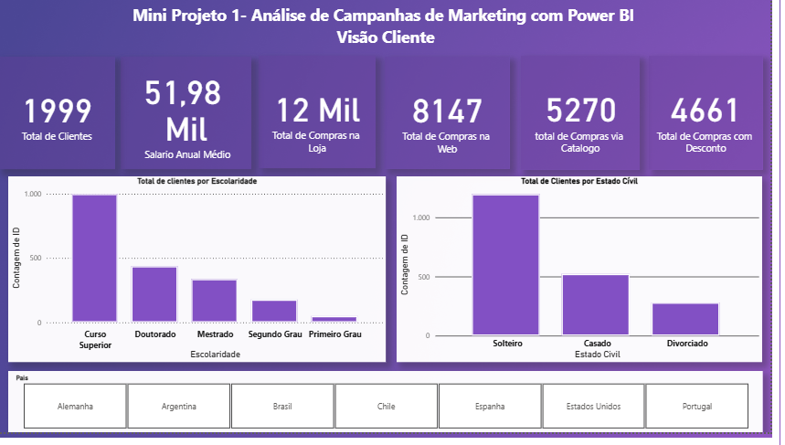
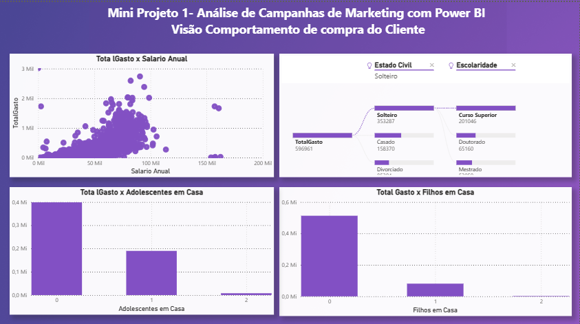
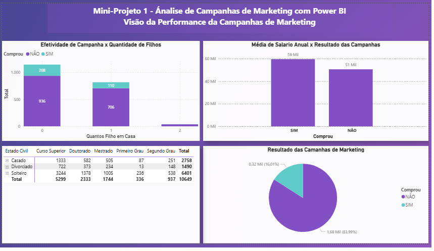
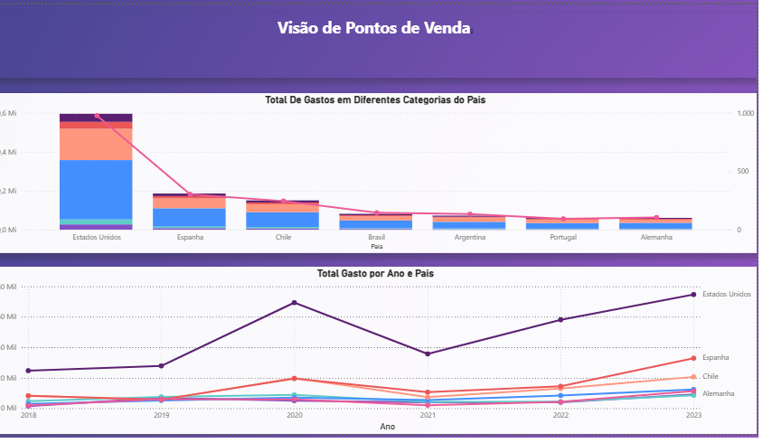

# 📊 Mini Projeto 1 — Análise de Campanhas de Marketing com Power BI

Este projeto foi desenvolvido como um **mini projeto de portfólio**, com foco em analisar campanhas de marketing e o comportamento dos clientes.  
O painel combina **modelagem de dados**, **medidas DAX** e **visualizações interativas** para gerar insights que apoiam decisões estratégicas.

---

## 🎯 Objetivos da Análise
- Identificar o perfil dos clientes (escolaridade, estado civil, país).
- Avaliar comportamento de compra em relação a salário, filhos e adolescentes em casa.
- Medir a performance das campanhas (taxa de conversão e média salarial dos que compraram vs. não compraram).
- Acompanhar a evolução dos gastos por país e ano.

---

## 🛠️ Técnicas Utilizadas
- **Modelagem de dados** para integrar clientes, compras e campanhas.  
- **Medidas DAX** para calcular totais, médias e taxas de conversão.  
- **Visualizações dinâmicas** que permitem explorar padrões e tendências.  

---

## 📈 Dashboards

### 👥 Visão Cliente

### 🛒 Comportamento de Compra

### 📢 Performance das Campanhas

### 🌍 Pontos de Venda

---

## 💡 Principais Insights
- Clientes solteiros com curso superior são os que mais respondem às campanhas.  
- A média salarial dos que compraram é significativamente maior do que a dos que não compraram.  
- Campanhas são mais eficazes em famílias sem filhos.  
- Estados Unidos e Espanha lideram em gastos ao longo dos anos.  

---

## 📁 Arquivo Power BI
Você pode baixar e explorar o arquivo do projeto:  
- [`campanhas-marketing.pbix`](campanhas-marketing.pbix)

---

## 📬 Contato
- **LinkedIn:**(https://linkedin.com/in/erikaleitao)  
- **E-mail:** erikasmletiao@gmail.com
