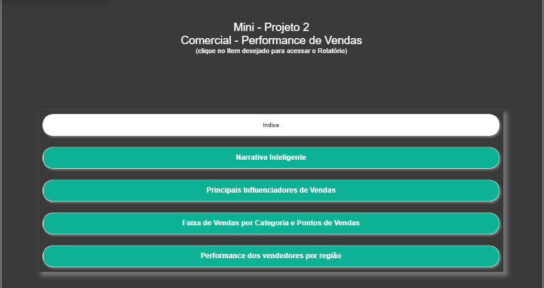
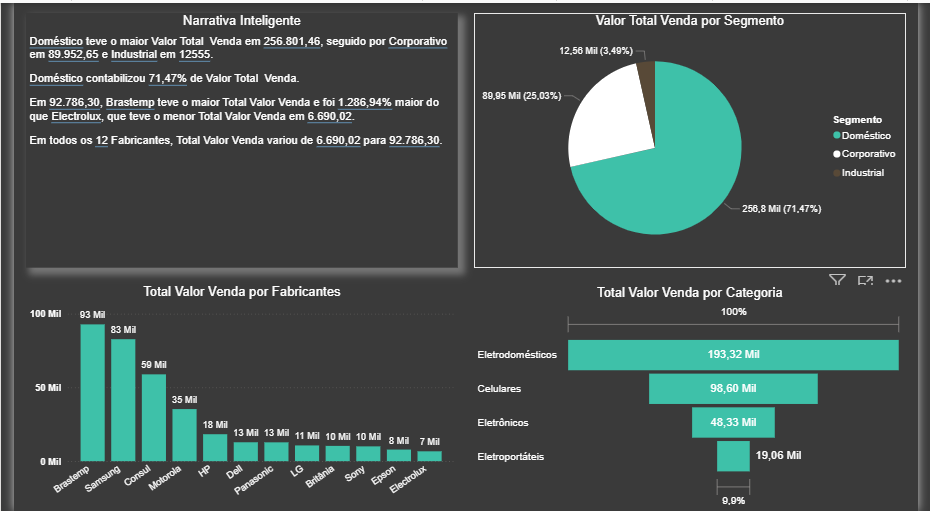
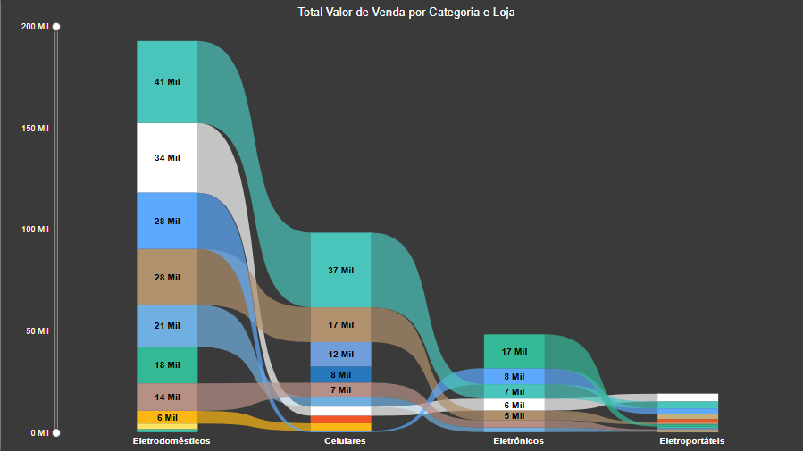
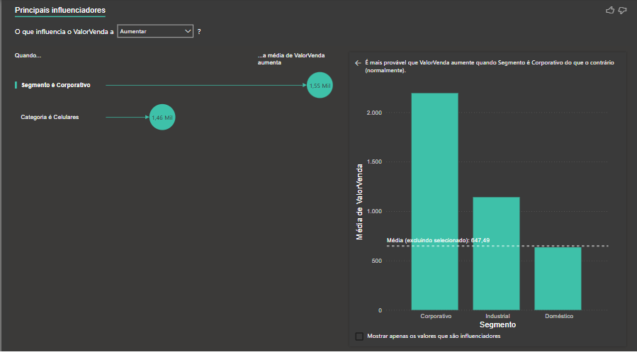
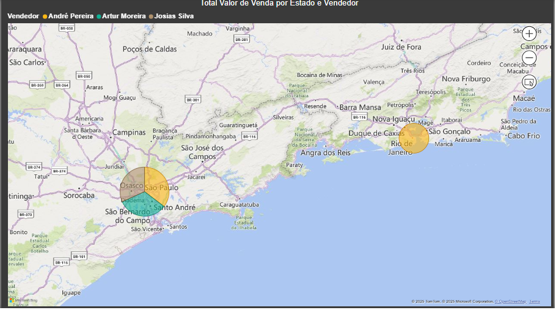

# 📊 Mini Projeto 2 — Performance de Vendas (Power BI)

Este projeto analisa a performance de vendas por segmento, categoria, fabricante e região.  
O painel utiliza **modelagem de dados**, **medidas DAX** e **narrativas inteligentes** para gerar insights estratégicos sobre comportamento de compra e atuação dos vendedores.

---

## 🎯 Objetivos da Análise
- Identificar os segmentos e categorias com maior volume de vendas.
- Avaliar os principais fabricantes e sua participação no total vendido.
- Mapear os fatores que influenciam o aumento do valor de venda.
- Visualizar a performance dos vendedores por estado e região.

---

## 🛠️ Técnicas Utilizadas
- **Modelagem de dados** para integrar vendas, produtos e vendedores.  
- **DAX** para cálculos de totais, médias e variações percentuais.  
- **Narrativa inteligente** para destacar os principais insights automaticamente.  
- **Sankey e mapas** para visualização de fluxo e distribuição geográfica.

---

## 📈 Dashboards

### 🧭 Menu de Navegação

### 📋 Narrativa Inteligente

### 🔄 Faixa de Vendas por Categoria e Loja

### 📊 Principais Influenciadores

### 🗺️ Performance por Estado e Vendedor

---

## 💡 Principais Insights
- Segmento Doméstico representa mais de 70% do valor total vendido.
- Brastemp lidera entre os fabricantes, com valor de venda 1.286% maior que Electrolux.
- Segmento Corporativo e categoria Celulares influenciam positivamente o valor médio de venda.
- São Paulo e Rio de Janeiro concentram os maiores volumes de venda por vendedor.

---

## 📬 Contato
- **LinkedIn:** (https://linkedin.com/in/erikaleitao)  
- **E-mail:** erikasmletiao@gmail.com
